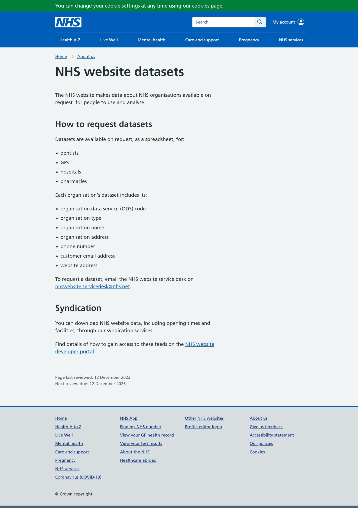

# Dataset - NHS Open Dataset
https://www.nhs.uk/about-us/nhs-website-datasets/

## Introduction
NHS Open Dataset is a free, on demand dataset with information about doctors, dentists and pharmacists.  It contains approximately 18 delimited files with all different headers and includes names and addresses.  It can therefore be used as an example of data containing Personally Identifiable Information (PII).

**NB** This dataset is now available via request only.

## Steps

1. Look at NHS Open Dataset in the browser
2. Download the smallest file and inspect it
------

**NHS Open data**
------

## Questions
- What do you observe about the file?
