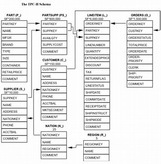
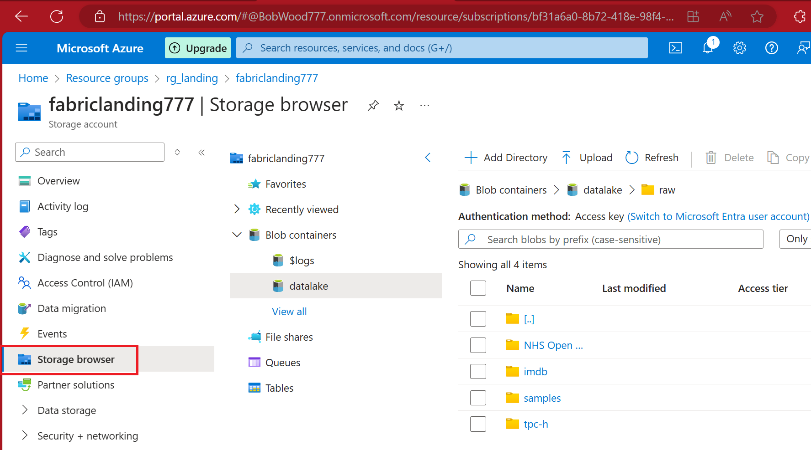

# Dataset - tpc-h
https://www.tpc.org/tpch/

## Introduction
tpc-h is a free dataset made available by the Transaction Processing Council (TPC) for benchmarking or volume tests.

The data is generated using an app they provide.  The number associated with tpc-h refers to the scale in GB of the output delimited files eg tcp-h 1 is approximately 1GB, tpc-h 10 is 10GB and so on.  Samples 1, 10 and 100 have been provided for the hack.

------

**tpc-h schema**
------

## Steps

1. From the Azure portal, go to the storage account
2. Look at Storage Browser > Blob Containers
3. Look at tpc-h 1 in the browser
4. Download nation.tbl (the smallest file) and inspect it
------

**tpc-h data**
------

## Questions
- What do you observe about the file?
