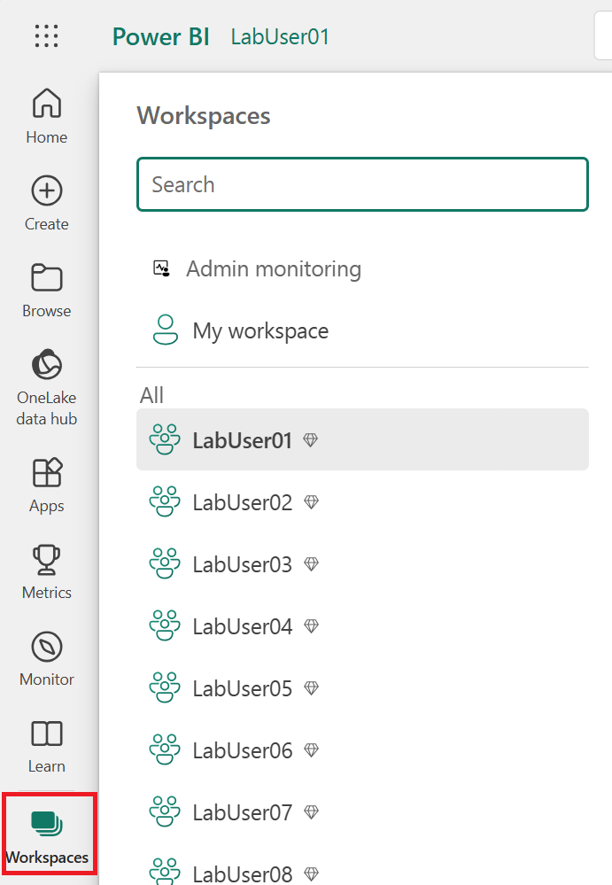

# Lab 1.3 - View your lab workspace 

## Steps

1. From the Fabric portal (logged into in lab 1.1) click **Workspaces**
2. Go to the Workspace that corresponds with your lab user name, eg user01 will be assigned LabUser01 etc

**Fig 1.3.1: Lab Workspaces**
-----------------

3. Click on that workspace
-----------------

## Questions
- What workspaces can you see?

## Recap
- We viewed the workspace set up for the hack