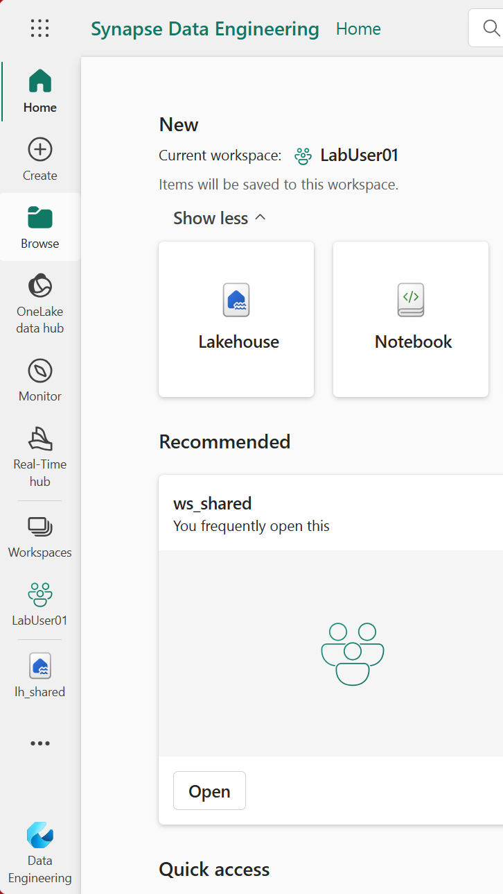

# Lab 1.5 - Create a Lakehouse 

## Steps

1. From the Fabric portal (logged into in lab 1.1) click **Workspaces**
2. Go to your Workspace called (for example) 'LabUser01'
3. Make sure you are in the Data Engineering persona

**Fig 1.5.1: Lab Workspace**
-----------------

4. Create a new Lakehouse, call it 'lh_mtc_hack'

-----------------

## Questions
- What is in the Lakehouse?

## Recap
- We created a new Lakehouse