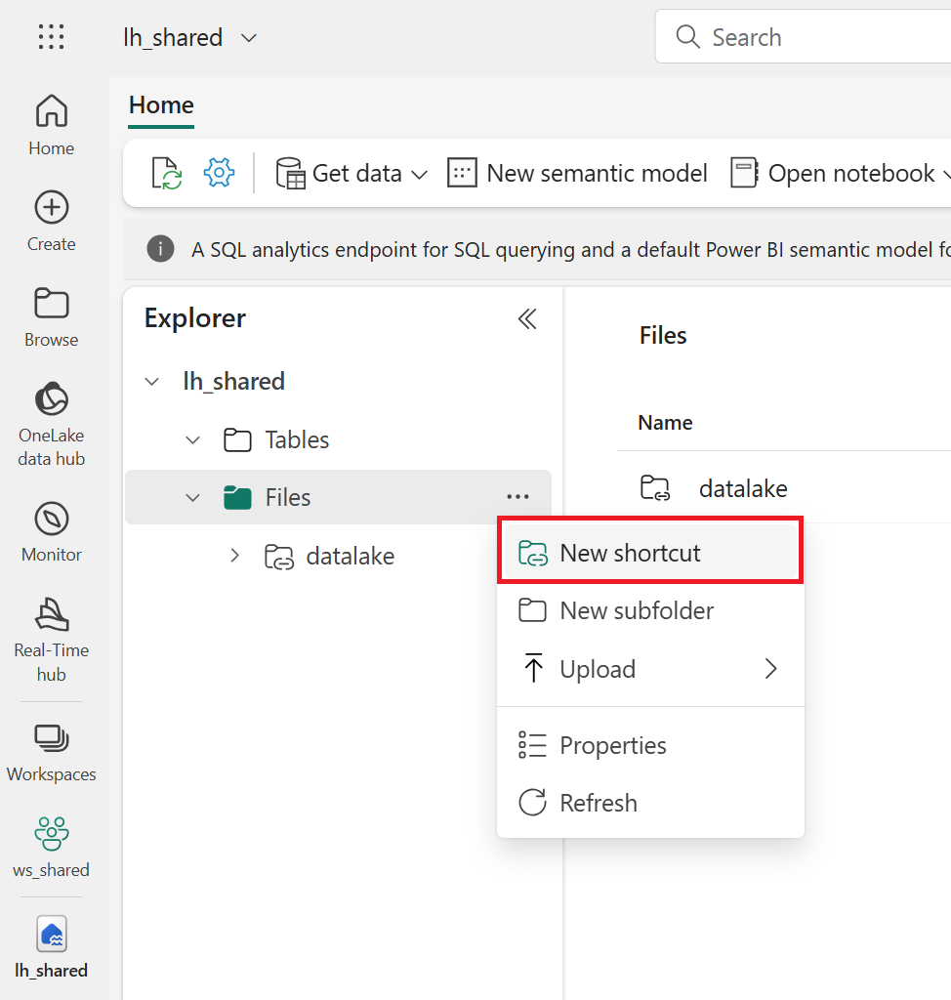
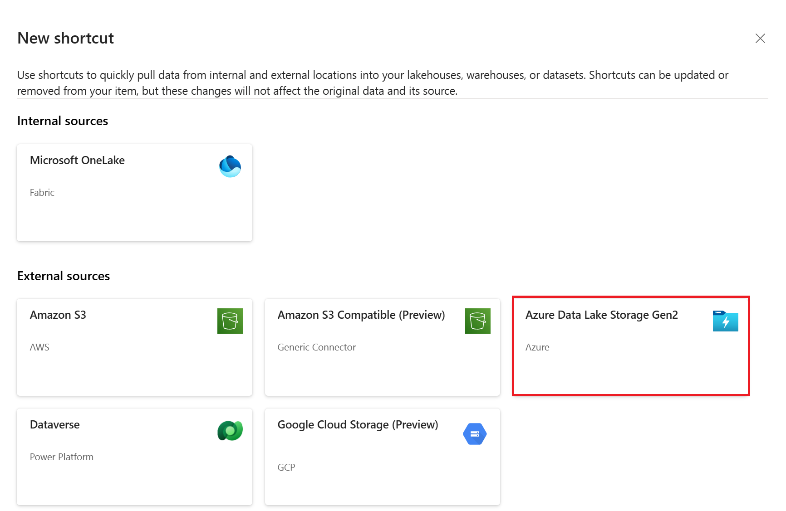
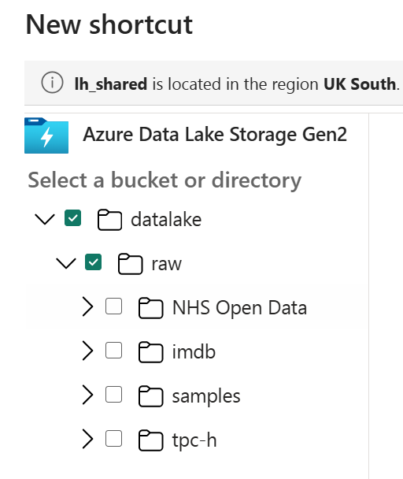

# Lab 1.5 - Create a shortcut 

## Steps

1. From the Fabric portal (logged into in lab 1.1) click **Workspaces**
2. Go to your Workspace called (for example) 'LabUser01'
3. Make sure you are in the Data Engineering persona
4. Go to the Lakehouse you created in the previous lab and click on Files
5. Then click on New shortcut

**Fig 1.6.1: New Shortcut**
-----------------

6. Set the shortcut type to 'Azure Data Lake Gen 2'

**Fig 1.6.2: ADLS Gen 2 Shortcut**

7. Set the path to: https://fabriclanding777.dfs.core.windows.net/
    - Hint: You can get this from the storage account, Settings > Endpoints 
8. Set the location to datalake > raw

**Fig 1.6.3: Shortcut folders**

9. Click Next, and Save

-----------------

## Questions
- Why create a shortcut?

## Recap
- We created a shortcut to the shared data