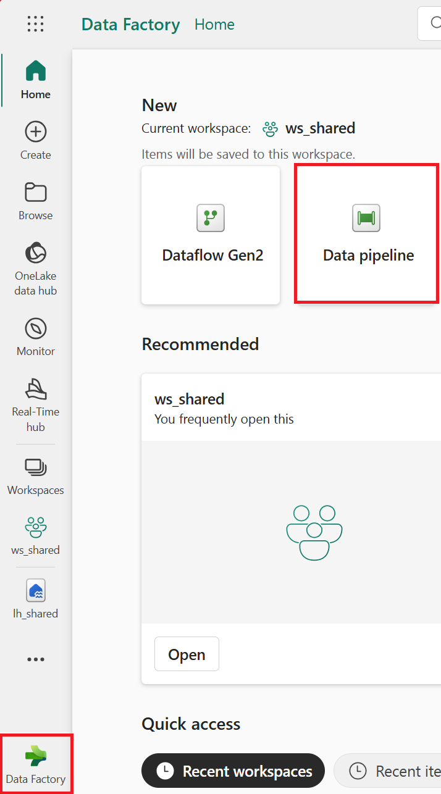
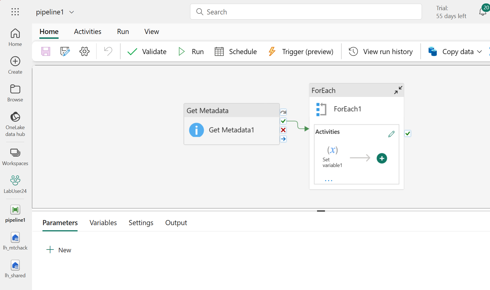
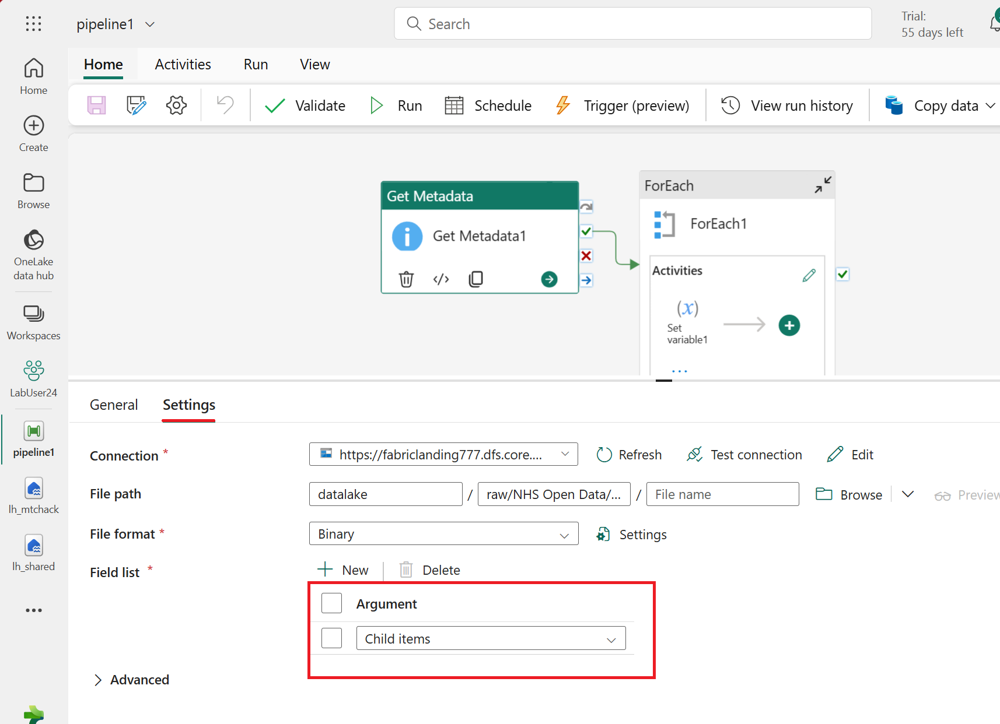
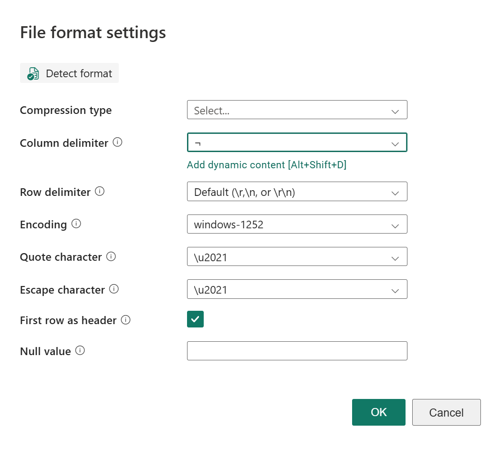
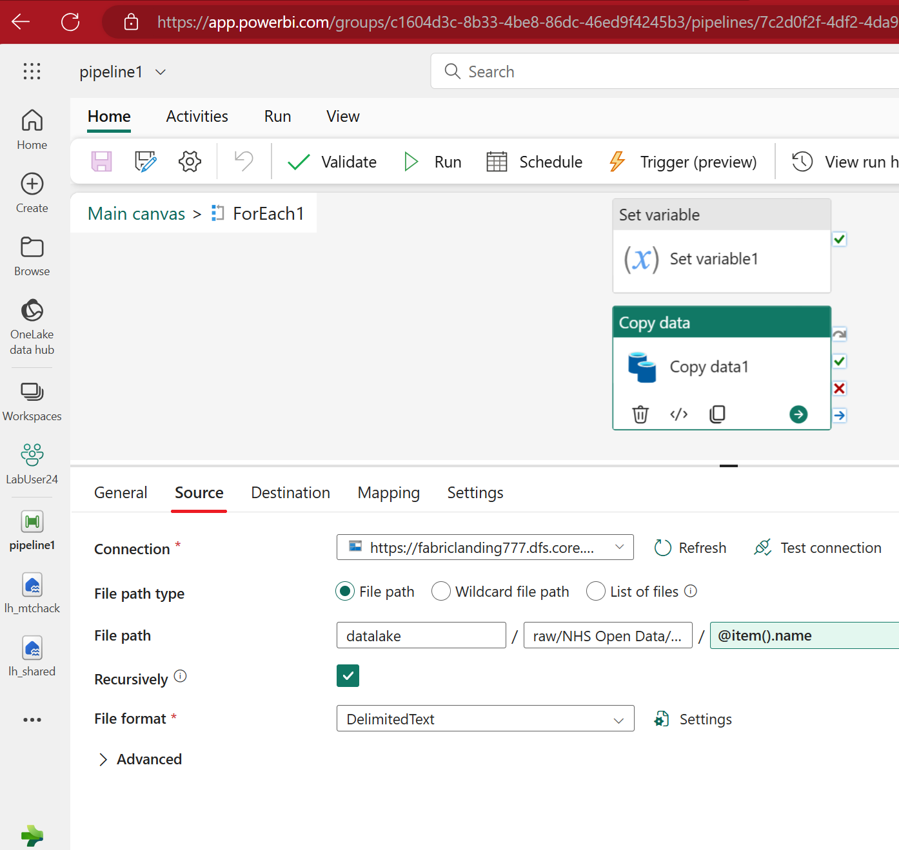

# Lab 2.0 - Import NHS Open data 

## Steps

1. Go to the Data Factory persona
2. Create a new Data Pipeline, call it pl_importNHSOpenData

------

**Fig 2.0.1: New Data Pipeline**
------


------

**Fig 2.0.2: New Data Pipeline**
------


3. Add a 'Get Metadata' activity
4. Configure it to point at the NHS Open data folder
5. Set the Field list property of the Get Metadata activity to ChildItems

------

**Fig 2.0.3: Field List**
------


6. Run the pipeline
7. Review the Input and Output folders
8. Add a For Each activity, set the Items to:
   - @activity('Get Metadata1').output.childItems
   - use the Dynamic Content GUI to help you add the information by clicking rather than typing
9. Add a Copy activity inside the For Each activty
10. Configure the Copy activity Source and Destination tabs

------

**Fig 2.0.3: File Format Settings**
------

------

**Fig 2.0.4: Source Settings**
------


11. Set the Destination Table expression to:

````bash
@replace(item().name, '.csv', '')
````

12. Run the pipeline and debug any errors.
13. Once, the data is loaded successfully, write some sql queries using the SQL Endpoint


## Questions
- What have we built here?
- Where is the schema for the different files mapped?

## Discussion
- This is a common pattern in Data Factory.  What are the implications?


## Recap
- We imported 18 files of all different schemas