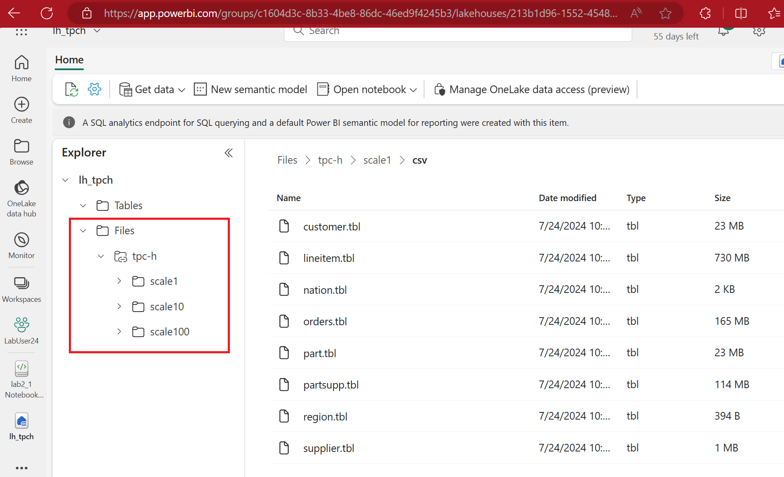

# Lab 2.1 - Import tpc-h data 

## Steps

1. Download the notebook (lab2_1 Notebook tpc-h Loading.ipynb) from the github
2. Create a new Lakehouse called lh_tpch
3. Create a shortcut in the new lakehouse to point at the tpc-h data

------

**Fig 2.1.1: tpc-h shortcut**
------

4. Go to the Data Engineering Persona and click 'Import Notebook'
5. Reconfigure the notebook parameter to point at your shortcut
6. Review and run the notebook code

------

**Fig 2.1.1: Notebook config**
------

7. Once, the data is loaded successfully, write some sql queries using the SQL Endpoint

## Questions
- What have we built here?
- Where is the schema for the different files mapped?

## Discussion
- This is a common pattern in Data Factory.  What are the implications?

## Recap
- We imported 7 files of all different schemas