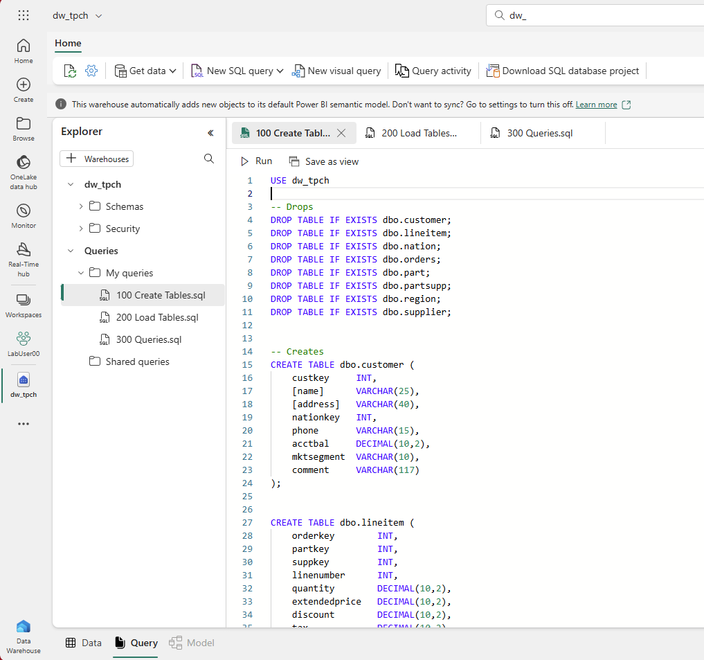

# Lab 2.3 - Import tpc-h data to a Data Warehouse

## Steps

1. Go to the Data Warehouse persona
2. Create a new Data Warehouse called dw_tpch
3. Run the script [100 Create Tables.sql](lab2_3%20100%20Create%20Tables.sql)
4. Run the script [200 Load Tables.sql](lab2_3%20200%20Load%20Tables.sql)
    - contact the Hack Admin for a new SAS token
5. Run the script [300 Load Queries.sql](lab2_3%20300%20Queries.sql)

------

**Fig 2.3.1: Data Warehouse Persona**
------

6. Once, the data is loaded successfully, write some sql queries using the SQL Endpoint

## Questions
- What have we built here?
- How is this different to the Lakehouse experience?

## Discussion
- Lakehouse v Data Warehouse

## Recap
- We imported 7 files of all different schemas into defined tables and ran some T-SQL queries