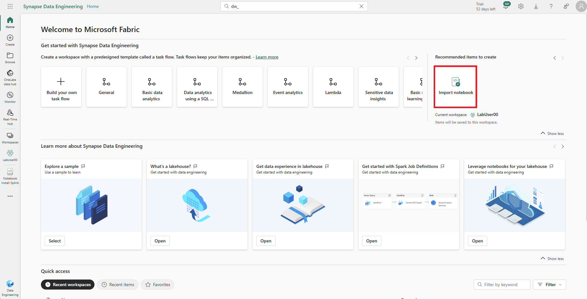
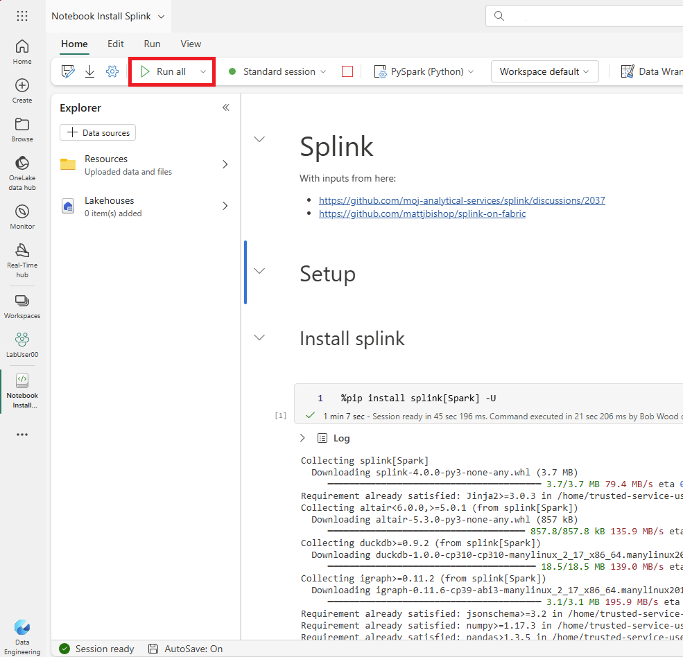

# Lab 5.0 - Install Splink in Microsoft Fabric

## Steps

1. Download the notebook [lab4_0 Notebook Install Splink.ipynb](lab4_0%20Notebook%20Install%20Splink.ipynb) to your machine from the github
2. Go to the Data Engineering Person, click 'Import Notebook'
3. Upload the notebook from your Downloads folder

------

------

4. Open the notebook and click 'Run all'

------

------

5. Exam the outputs from Splink.  

## Questions
- What records have been matched?

## Discussion
- Could Splink be used for matching in your organisation?  What are the pros and cons of splink?

## Recap
- We installed Splink in Fabric and ran the Quickstart