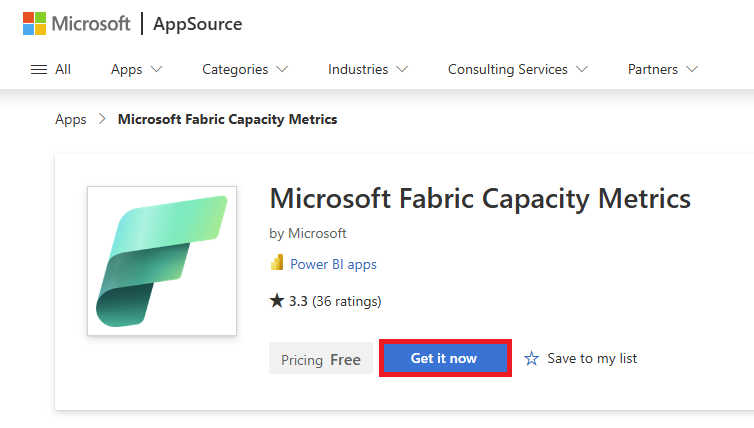
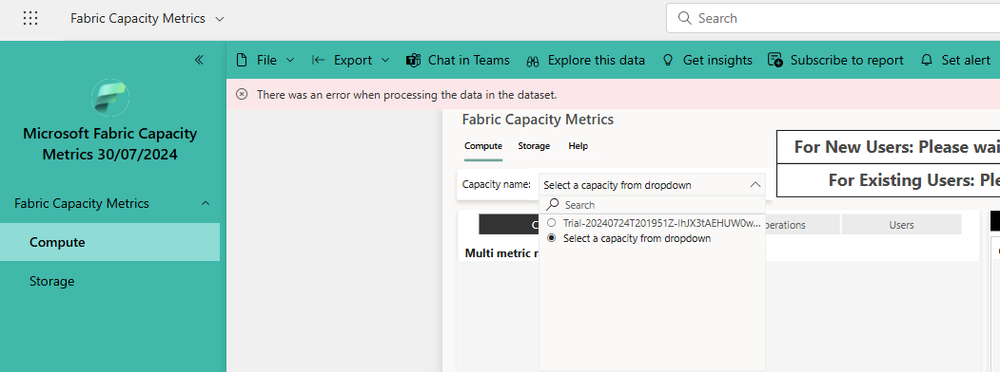

# Lab 5.0 - Install the Fabric Capacity Metrics App

## Steps

1. Install the **Fabric Capacity Metrics App** by going to this link and clicking 'Get it now':  
https://appsource.microsoft.com/en-us/product/power-bi/pbi_pcmm.microsoftpremiumfabricpreviewreport?exp=ubp8

------

------

2. The app will install.  You can then click on it and click the **Capacity name** dropdown to select a capacity you are interested in:

------

------

3. The app can sometimes take a while to populate so try it later if you receive an error.